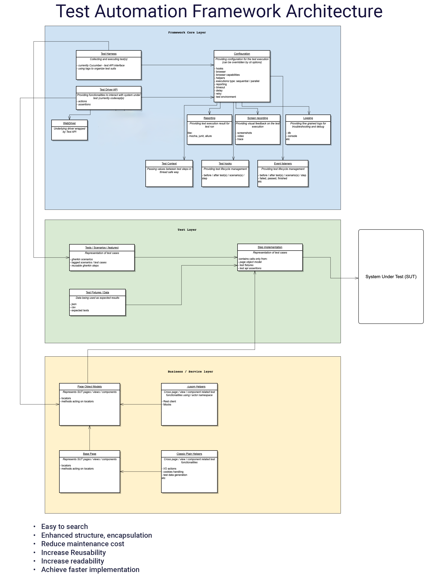

# Selenium Test Automation Framework

- Author: Attila Gyori
- Email: gyoriattila@yahoo.com
- Website: https://attila-gyori.com

> Selenium 4.20.0 with Spring Boot, Page Object Model, cucumber and extent report project with Selenium

![Selenium][Selenium]
![Spring][Spring]
![Cucumber][Cucumber]
![CucumberReport][CucumberReport]
![ExtentReport][ExtentReport]
![Hamcrest][Hamcrest]
![Assertj][Assertj]
![Lombok][Lombok]

## 🚀 Run Tests (test set runs with 2 threads parallel by default)

1. ___Local Execution___:
   1. mvn clean test -Dcucumber.filter.tags="@ui" -Dspring.profiles.active=local
   2. mvn clean test -Dcucumber.filter.tags="@tc01" -Dbrowser=chrome -Dspring.profiles.active=local (specific implemented tc execution)
      1. to specify the browser use -Dbrowser=chrome, edge or firefox
      2. to run in parallel: mvn clean test -Dcucumber.filter.tags="@ui" -Dbrowser=chrome -Ddataproviderthreadcount=2
2. ___Remote Execution___: 
   1. mvn clean test -Dcucumber.filter.tags="@ui" -Dbrowser=chrome -Dspring.profiles.active=remote-with-local-grid-compose
      1. Requires docker. It utilizes spring-boot-docker-compose to spin up selenium grid using docker-compose:
      2. default browser: Chrome. To specify the browser use -Dbrowser=edge or firefox
3. ___Custom Remote:___
   1. mvn clean test -Dremote -Dselenium.grid.url=url -Dbrowser=chrome
      1. url: of selenium grid 
      2. default browser: Chrome. To specify the browser use -Dbrowser=edge or firefox
4. ___Execute Framework Unit tests:___
   1. mvn clean test -Punittest
5. ___Parallel Execution:___
   1. By default dataproviderthreadcount is 1 running tests in one thread
      1. use -Ddataproviderthreadcount=2 to run test set in parallel
   2. @ui test set can be run in parallel

## 📋Test Output
1. ___Cucumber report:___ /reports/cucumber-report.html
2. ___Extent Report:___ /reports/date-folder/
3. ___Videos___ in remote execution: /reports/videos/
4. ___Logs:___ /logs

## 🐙 Selenium Grid
1. ___Selenium Dashboard:___ localhost:4444
2. ___Remote VNC___ to harness container: localhost:7900 (Chrome), localhost:7901 (Edge),localhost:7902 (Firefox),

## ✍Test Automation Framework Architecture

## 📄Manual Test Cases [xls](./test-cases/HW_Calkoo_Test_Cases.xlsx) (./test-cases/HW_Calkoo_Test_Cases.xlsx)

## 🐞 Findings:
1. ___Missing "pie chart value"___
steps to reproduce:
around 5% VAT rate pie chart orange lable percentage not displayed
2. ___Entered decimals can be more than 2 decimals___:
   Amounts can be entered with maximum 2 decimal digit precision
   Selected Input value: it is allowed to type more than 2 decimals precision while calculated inputs
   remain with 2 decimals precision
3. ___Country Drop down search cant be interrupted___ - usability:
   if I type "Ni" in country drop down finding Nicaragua and press Esc it remains on Nicaragua and doesnt
   fall back to the previousely selected country
   Same happens if I click outside the country drop down after typing 'Ni"
4. ___Disabled Input fields are editable___:
   If "Price without VAT" input checkbox is selected:
   "Value-Added Tax" and "Price incl. VAT" should be disabled and not just grayed out,
   app allows to type in seemingly disabled input

5. ___Input value disappears on input click___- usability:
   When I clicked in a an input - no matter it is disabled or active
   ("Price without VAT", "Value-Added Tax","Price incl. VAT") previouse input value disappears from the
   given input
   1. set "Price without VAT" to 100 -> "Value-Added Tax" calculated as "10.00" "Price incl. VAT"
      calculated as "110.00"
   2. click in "Value-Added Tax" input -> value disappears
6. ___Previous selection not kept in case of Reset - usability:___
   Select Country "Austria"
   Select VAT rate 10%
   Select calculation input: "Value-Added Tax"
   Press "Reset" button: previous selections are not kept
7. ___NaN displayed as values:___
Changing VAT rate from default without inputs result is NaN input value in calculated inputs
   Select Country "Austria"
   Select VAT rate 10%
   Calculated values of inputs "Value-Added Tax" and "Price incl. VAT" displayed as "NaN"
8. ___Pie Chart tooltip decimals are incorrect:___
   1.	Select a country Austria 	
   2.	Select a VAT rate 10%
   3.	Select "Price without VAT"  as the input type (all other inputs are incorrectly allows more than 2 decimal precision to type)
   4.	Enter 100.00 as the "Price without VAT"  input amount.
      Calculated inputs displayed with 2 decimal precision:"Value-Added Tax" input calculated as "10.05" and
      "Price incl. VAT" input calculated as "110.55"
   5. Pie Chart tooltips: orange part: VAT tooltip shows "10.05"
      but blue part: Price shows incorrect decimal precision instead of "100.50" it displayes "100.5"
      it is inconsistent
9. ___No error message in case of value higher than 999.999.999___:
   it is not allowed to type more than 9 digits in the input field. - there is no error message, cause simply you cant type
   more than 9 digits in the input fields
10. ___Inconsistent pie chart display___:
 if I enter negative value in any of the inputs, pie chart error message says: Negative velue invalid for a pie chart
    If I enter 0, then pie chart not displayed
    I suggest that it should be consistent for both cases: display error message for 0 and negative,
    or dont display pie chart for 0 and negative
11. ___Space handling is incorrect___:
    Currently input fileds allow speced to be entered and they are trimmed
    In case of space, Input validation allert should be displayed instead of calculation
<!-- MARKDOWN LINKS & IMAGES -->
<!-- https://www.markdownguide.org/basic-syntax/#reference-style-links -->

[Selenium]: https://img.shields.io/badge/Selenium-blue
[Cucumber]: https://img.shields.io/badge/Cucumber-8A2BE2
[Spring]: https://img.shields.io/badge/Spring-purple
[CucumberReport]: https://img.shields.io/badge/Cucumber_Report-orange
[ExtentReport]: https://img.shields.io/badge/Extent_Report-green
[Hamcrest]: https://img.shields.io/badge/Hamcrest-192FT1
[Assertj]: https://img.shields.io/badge/Assertj-122BE2
[Lombok]: https://img.shields.io/badge/Lombok-8A2BE2
